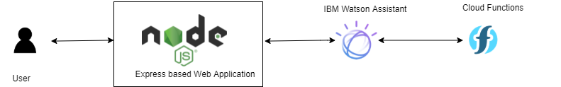

## Short description

### What's the problem?

Agriculture is a major contributor to India's employment. India is a global agricultural powerhouse. Yet, the agricultural sector faces a lot of challenges like high dependance on rainfall ( with farmers not able to predict weather), lack of Markets, lack of response from concerned parties etc. Farmers struggle to find the optimal crop that should be grown. Every year, so many farmers commit suicide due to the depressing truth of agriculture!

### How can technology help?

Agriculture is a sphere which has high asymmetric information. Most of the farmers lack information related to optimal crops, weather, fertlizers, pesticides, government policies etc. Technology enables to bridge this information gap by taking all this information at the hand of farmer.

### The idea

Our easy to use chatbot acts a one stop solution for farmers. Farmers can get weather predictions, optimal crop that should be grown in their region in a particular season, location specific recommendations and market mapping. Farmers can also raise their concerns and get guidance accordingly! 

## Demo video
https://youtu.be/TKMY3d19gj8

## The architecture

## Project Features

The project currently does the following things:

- Weather Predictions:
The farmer can see the weather predicted for the next seven days.
- Crop Recommendation:
Based on the conditions of the area (ph, temperature, humidity, rainfall etc), crops are recommended to the user. 
- Market Availability:
The farmer can check markets nearby his area where he can sell/buy his crops and also he can see the current prices of the commodities and its varieties in the market.
- Raise Issues/Concerns:
If there are some issues or concerns, those are addressed accordingly and stored for future analysis.
- Suggestions/Recommendations:

## Future Roadmap
There are things which are still in progress:
- Fertiliser recommendation:
Based on the soils and crops, fertilisers would be suggested to the farmer
- Market communication:
Providing farmer platform where he can communicate with other farmers near his area.
- Policies recommendation:
Based on the location, government policies and NGOs support policies would be recommended.

## Built With
- IBM Watson Assistant
- IBM Cloud Functions
- IBM Cloud Foundary
- Node JS + Express

## Live demo

Enter working link here
